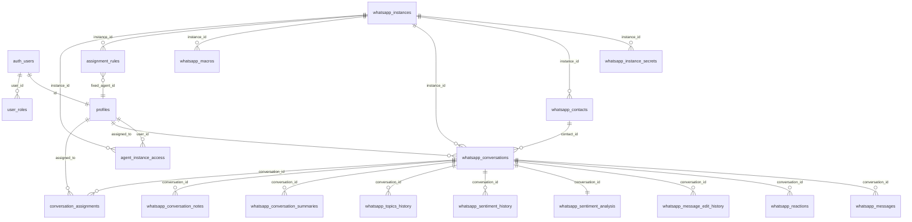

# ENTENDIMENTO — Plataforma de Atendimento via WhatsApp

> Documento de engenharia reversa **read-only**. Commit analisado: `10c093d` (branch `main`).
> Toda afirmação técnica é acompanhada de `caminho/arquivo:linha`. Lacunas estão marcadas com `❓ INCERTEZA`.

---

## 1. TL;DR

Plataforma web de **atendimento ao cliente via WhatsApp** para equipes (estilo "caixa de entrada compartilhada"
multi-agente). Permite conectar várias instâncias de WhatsApp (via **Evolution API**, self-hosted ou cloud),
receber/enviar mensagens em tempo real, atribuir conversas a atendentes (manual ou por regras automáticas),
e usa **IA (Lovable AI Gateway / Google Gemini)** para análise de sentimento, resumo de conversa, categorização
por tópicos, sugestões de resposta, reescrita de mensagens e transcrição de áudio. Inclui relatórios/métricas,
gestão de equipe com papéis (admin/supervisor/agent), macros e onboarding guiado.

- **Stack:** React 18 + TypeScript + Vite + shadcn/ui + Tailwind (frontend SPA); Supabase (Postgres + Auth +
  Storage + Realtime + Edge Functions em Deno) como backend; Evolution API (WhatsApp) e Lovable AI (IA) como externos.
- **Origem:** projeto gerado/mantido via **Lovable** ([README.md:1-5](../README.md#L1-L5)); empacotado com **bun** e **npm** (ambos lockfiles presentes).
- **Maturidade:** funcional e relativamente maduro em features (45 migrations, 21 edge functions, ~150 arquivos `src/`),
  mas com **dívidas de segurança relevantes** (ver §7) e **sem testes automatizados nem CI** (ver §9).
- **Público-alvo:** times de atendimento/SAC/comercial que operam WhatsApp em escala.

---

## 2. Stack e setup local

### Stack identificada (Fase 0)

| Camada | Tecnologia | Evidência |
|---|---|---|
| Linguagem | TypeScript 5.8 | [package.json:82](../package.json#L82), [tsconfig.json](../tsconfig.json) |
| Build/Dev | Vite 5.4 + `@vitejs/plugin-react-swc` | [package.json:7-11,84](../package.json#L7), [vite.config.ts](../vite.config.ts) |
| UI | React 18.3 + shadcn/ui (Radix) + Tailwind 3.4 | [package.json:54-65](../package.json#L54), [components.json](../components.json) |
| Estado servidor | TanStack React Query 5.83 | [package.json:43](../package.json#L43), [src/App.tsx:19](../src/App.tsx#L19) |
| Roteamento | react-router-dom 6.30 | [package.json:59](../package.json#L59), [src/App.tsx:33-41](../src/App.tsx#L33) |
| Formulários/validação | react-hook-form 7.61 + zod 3.25 | [package.json:57,65](../package.json#L57) |
| Gráficos | recharts 2.15 | [package.json:60](../package.json#L60) |
| Backend (BaaS) | Supabase JS 2.85 (Postgres+Auth+Storage+Realtime+Edge Functions) | [package.json:42](../package.json#L42), [src/integrations/supabase/client.ts](../src/integrations/supabase/client.ts) |
| Edge Functions | Deno (`Deno.serve`) | [supabase/functions/*/index.ts](../supabase/functions) |
| Pacotes | **bun** (`bun.lockb`) e **npm** (`package-lock.json`) — ambos commitados | raiz do repo |
| Tema | next-themes 0.3 (dark mode) | [package.json:53](../package.json#L53) |
| Tooling Lovable | `lovable-tagger` (dev) | [package.json:79](../package.json#L79) |

### Scripts disponíveis ([package.json:6-12](../package.json#L6))

- `dev` → `vite` (servidor de desenvolvimento com HMR)
- `build` → `vite build` (build de produção)
- `build:dev` → `vite build --mode development`
- `lint` → `eslint .` ([eslint.config.js](../eslint.config.js))
- `preview` → `vite preview` (servir build localmente)

### Setup local

1. Pré-requisitos: Node.js + npm (ou bun). [README.md:21](../README.md#L21).
2. `npm i` (ou `bun install`).
3. Configurar variáveis em `.env` (já presente no repo — ver §7): `VITE_SUPABASE_PROJECT_ID`,
   `VITE_SUPABASE_PUBLISHABLE_KEY`, `VITE_SUPABASE_URL` ([.env.example](../.env.example)).
4. `npm run dev` → app em `http://localhost:8080` (porta padrão Vite/Lovable; ❓ confirmar em [vite.config.ts](../vite.config.ts)).

> **Não existe no repo:** Dockerfile, docker-compose, Makefile, Procfile, CI (`.github/workflows`),
> `requirements.txt`/`pyproject`/`composer.json`/`go.mod` (não é projeto poliglota). O deploy é feito via
> **Lovable → Publish** ([README.md:63-65](../README.md#L63)). Edge functions e migrations rodam no Supabase.

---

## 3. Mapa estrutural

### Arquitetura macro

**SPA React (cliente)** + **BaaS Supabase (servidor)**. Não há servidor Node próprio: a lógica de servidor vive
em **Edge Functions Deno** no Supabase e em **RLS/triggers/funções Postgres**. O cliente fala com o backend por
três caminhos (ver §3.3): (a) Supabase client direto (CRUD com RLS), (b) `functions.invoke()` para edge functions
(integrações externas/IA), (c) Realtime subscriptions (`postgres_changes`). Evidência do padrão:
[src/hooks/whatsapp/useWhatsAppConversations.ts](../src/hooks/whatsapp/useWhatsAppConversations.ts),
[src/hooks/whatsapp/useWhatsAppSend.ts](../src/hooks/whatsapp/useWhatsAppSend.ts).

### 3.1 Diagrama de pastas comentado

```
raiz/
├── .env / .env.example      → config Supabase (⚠ .env versionado, §7)
├── .lovable/plan.md         → artefato do Lovable (histórico de prompts/plano)
├── index.html               → HTML root, monta #root → src/main.tsx
├── package.json / *.lock    → deps e scripts (npm + bun)
├── tailwind.config.ts       → design tokens (cores HSL, fonte DM Sans)
├── vite.config.ts           → config do bundler
├── public/                  → assets estáticos
├── src/                     → aplicação React (frontend)
│   ├── main.tsx             → entrypoint (createRoot)
│   ├── App.tsx              → providers globais + rotas
│   ├── index.css            → tokens CSS + import de fonte
│   ├── pages/               → páginas de rota (Auth, WhatsApp, Relatorio, Contatos, Settings, etc.)
│   ├── components/          → componentes de UI por domínio (auth, chat, conversations, contacts,
│   │                          reports, settings, macros, setup, notifications, ui[shadcn])
│   ├── contexts/            → estado global (AuthContext, NotificationContext)
│   ├── hooks/               → lógica de dados (React Query); subpasta whatsapp/ = 26 hooks do domínio
│   ├── integrations/supabase→ client.ts (cliente) + types.ts (tipos gerados do schema)
│   ├── constants/           → constantes (conversationTopics)
│   ├── lib/utils.ts         → util cn() (clsx+tailwind-merge)
│   └── utils/               → helpers puros (telefone, datas, export, validação de domínio, som)
└── supabase/                → backend
    ├── config.toml          → project_id (mínimo)
    ├── functions/           → 21 Edge Functions Deno (webhook, envio, IA, setup, admin)
    │   └── _shared/         → evolution-helpers.ts (normalização de telefone, tipo de msg)
    └── migrations/          → 45 arquivos SQL (schema, RLS, triggers, funções, storage)
```

### 3.2 Pontos de entrada

- **Frontend:** [index.html:26](../index.html) → [src/main.tsx:1-6](../src/main.tsx#L1-L6) (`createRoot(...).render(<App/>)`)
  → [src/App.tsx:24-44](../src/App.tsx#L24) (providers + `BrowserRouter`).
- **Rotas** (ver tabela §8.1) em [src/App.tsx:33-41](../src/App.tsx#L33).
- **Webhook externo (entrada de eventos WhatsApp):** [supabase/functions/evolution-webhook/index.ts:978](../supabase/functions/evolution-webhook/index.ts#L978) (`Deno.serve`) — recebe `messages.upsert`, `messages.update`, `connection.update`.
- **Job de polling de status:** [supabase/functions/check-instances-status/index.ts](../supabase/functions/check-instances-status/index.ts) (❓ INCERTEZA: não há definição de cron no repo — provavelmente agendado fora, no painel Supabase).
- **Triggers de banco** (entrada via DB): `handle_new_user` em `auth.users` INSERT, `archive_sentiment_to_history`,
  `archive_topics_to_history`, `update_updated_at_column` ([migrations](../supabase/migrations)).

### 3.3 Como o frontend conversa com o backend

| Padrão | Quando | Exemplo |
|---|---|---|
| Supabase client direto (`.from().select/insert/update`) | leituras/escritas cobertas por RLS | [useWhatsAppConversations.ts:46](../src/hooks/whatsapp/useWhatsAppConversations.ts#L46) |
| `supabase.functions.invoke('...')` | integrações externas, IA, ações admin | [useWhatsAppSend.ts](../src/hooks/whatsapp/useWhatsAppSend.ts), [useSmartReply.ts](../src/hooks/whatsapp/useSmartReply.ts) |
| Realtime `channel().on('postgres_changes')` | dados que mudam ao vivo (msgs, conversas, sentimento, reações, notas) | [useWhatsAppConversations.ts:172-194](../src/hooks/whatsapp/useWhatsAppConversations.ts#L172) |

---

## 4. Catálogo de funcionalidades

> Cada feature: onde mora · fluxo end-to-end · dados · externos · regras observadas.

### 4.1 Autenticação, cadastro e aprovação de usuários
- **Onde:** [src/contexts/AuthContext.tsx](../src/contexts/AuthContext.tsx), [src/components/auth/*](../src/components/auth), [src/pages/Auth.tsx](../src/pages/Auth.tsx), [src/pages/PendingApproval.tsx](../src/pages/PendingApproval.tsx), edge [ensure-user-profile](../supabase/functions/ensure-user-profile/index.ts).
- **Fluxo:** `LoginForm/SignupForm` (zod, senha ≥6 [LoginForm.tsx:14-17](../src/components/auth/LoginForm.tsx#L14)) → `AuthContext.signIn/signUp` → Supabase Auth → após sessão, `ensure-user-profile` cria `profiles`+`user_roles` → `ProtectedRoute` redireciona conforme aprovação/role.
- **Regras:** primeiro usuário vira **admin auto-aprovado**; demais recebem `agent` e `is_approved = NOT require_account_approval` (trigger `handle_new_user`, [migration 20251201183217:1-52](../supabase/migrations/20251201183217_99feb92f-6359-4131-aedf-a6d8a9004473.sql#L1)). Aprovação atualmente **desabilitada por padrão** (commit `0221fc9` "Desativou aprovação e liberou"). Não aprovado → `/pending-approval` ([ProtectedRoute.tsx:16-20](../src/components/auth/ProtectedRoute.tsx#L16)). Validação opcional de domínio de e-mail ([src/utils/domainValidation.ts](../src/utils/domainValidation.ts)).
- **Dados:** `profiles`, `user_roles`, `project_config`. **Externos:** —.

### 4.2 Gestão de equipe e papéis
- **Onde:** [src/components/settings/TeamMembersList.tsx](../src/components/settings/TeamMembersList.tsx), `InviteMemberDialog`, `ChangeRoleDialog`, `DeactivateMemberDialog`, hook [useTeamManagement.ts](../src/hooks/useTeamManagement.ts), edges [invite-team-member](../supabase/functions/invite-team-member/index.ts) e [delete-user-account](../supabase/functions/delete-user-account/index.ts).
- **Fluxo:** admin convida → `invite-team-member` cria usuário (Auth Admin API) e seta role em `user_roles` ([invite-team-member/index.ts:36-55](../supabase/functions/invite-team-member/index.ts#L36)); alterar role/ativar/aprovar via update direto em `user_roles`/`profiles` ([useTeamManagement.ts](../src/hooks/useTeamManagement.ts)).
- **Regras:** papéis `admin|supervisor|agent` (enum `app_role`). `delete-user-account` bloqueia remoção do **único admin** ([delete-user-account/index.ts:38-54](../supabase/functions/delete-user-account/index.ts#L38)). ⚠ `invite-team-member` **não checa se o chamador é admin** (§7, risco R3).

### 4.3 Gestão de instâncias WhatsApp (conexão/QR/status)
- **Onde:** [src/components/settings/Instance*.tsx](../src/components/settings), hook [useWhatsAppInstances.ts](../src/hooks/whatsapp/useWhatsAppInstances.ts), edges [test-instance-connection](../supabase/functions/test-instance-connection/index.ts), [test-evolution-connection](../supabase/functions/test-evolution-connection/index.ts), [check-instances-status](../supabase/functions/check-instances-status/index.ts).
- **Fluxo:** admin cadastra instância (`instance_name`, `api_url`, `api_key`, `provider_type`) → grava `whatsapp_instances` + segredos em tabela separada `whatsapp_instance_secrets` (com rollback se falhar [useWhatsAppInstances.ts:58-72](../src/hooks/whatsapp/useWhatsAppInstances.ts#L58)) → testar conexão chama `GET {api_url}/instance/connectionState/{instance}` ([test-instance-connection/index.ts:67-98](../supabase/functions/test-instance-connection/index.ts#L67)).
- **Regras:** `provider_type ∈ {self_hosted, cloud}`; cloud usa `instance_id_external` (UUID), self-hosted usa `instance_name`. Status mapeado open→connected / connecting / close→disconnected. **Externo:** Evolution API. Banner de instâncias desconectadas: [DisconnectedInstancesBanner.tsx](../src/components/notifications/DisconnectedInstancesBanner.tsx) + [useInstanceStatusMonitor.ts](../src/hooks/useInstanceStatusMonitor.ts).

### 4.4 Controle de acesso de agentes a instâncias
- **Onde:** [src/components/settings/InstanceAccessManager.tsx](../src/components/settings/InstanceAccessManager.tsx), [useInstanceAccess.ts](../src/hooks/useInstanceAccess.ts), tabela `agent_instance_access`, função `can_user_see_instance()`.
- **Regra:** se não houver linhas para o usuário → vê **todas** as instâncias; se houver → vê apenas as listadas ([migration 20260617130632:33-46](../supabase/migrations/20260617130632_451d8f02-0d98-4cbe-a310-15d772c02134.sql#L33)).

### 4.5 Conversas: lista, filtros, fila
- **Onde:** [src/components/conversations/*](../src/components/conversations), [src/components/ConversationList.tsx](../src/components/ConversationList.tsx), hook [useWhatsAppConversations.ts](../src/hooks/whatsapp/useWhatsAppConversations.ts).
- **Fluxo:** `ConversationsSidebar` → `useWhatsAppConversations` faz 3 queries paralelas (dados+contato, contagem total, não-lidas) com paginação `range()` e filtros (status, atribuição, instância) ([useWhatsAppConversations.ts:35-136](../src/hooks/whatsapp/useWhatsAppConversations.ts#L35)) + realtime. `QueueIndicator`/`waitingCount` modelam a "fila" de não atribuídas.
- **Dados:** `whatsapp_conversations` ⋈ `whatsapp_contacts`. Acesso por RLS `can_access_conversation()`.

### 4.6 Atribuição de conversas (manual e automática)
- **Onde:** manual [AssignAgentDialog.tsx](../src/components/conversations/AssignAgentDialog.tsx) + [useConversationAssignment.ts](../src/hooks/whatsapp/useConversationAssignment.ts); regras [AssignmentRulesManager.tsx](../src/components/settings/AssignmentRulesManager.tsx) + [useAssignmentRules.ts](../src/hooks/whatsapp/useAssignmentRules.ts); aplicação automática no webhook.
- **Fluxo automático:** ao criar conversa, `applyAutoAssignment()` busca regra ativa da instância → `fixed` (agente fixo) ou `round_robin` (rotaciona `round_robin_last_index`) → grava `assigned_to` + log em `conversation_assignments` ([evolution-webhook/index.ts:287-352](../supabase/functions/evolution-webhook/index.ts#L287)).
- **Regras:** 1 regra ativa por instância (índice único). ⚠ possível **race condition** no round-robin sob concorrência (§7, R8).

### 4.7 Chat — envio de mensagens (texto/mídia/áudio)
- **Onde:** [src/components/chat/input/*](../src/components/chat/input), [useWhatsAppSend.ts](../src/hooks/whatsapp/useWhatsAppSend.ts), edge [send-whatsapp-message](../supabase/functions/send-whatsapp-message/index.ts).
- **Fluxo:** input → `useWhatsAppSend` (optimistic update) → `send-whatsapp-message` valida payload, resolve instância+segredos, monta request e chama Evolution `/message/sendText|sendMedia|sendWhatsAppAudio/{instance}` → grava `whatsapp_messages` (status `sent`) e atualiza preview da conversa ([send-whatsapp-message/index.ts:44-219](../supabase/functions/send-whatsapp-message/index.ts#L44)).
- **Suporta:** reply (`quoted_message_id`), upload de mídia (base64/URL), gravação de áudio ([AudioRecorder.tsx](../src/components/chat/input/AudioRecorder.tsx)), emoji ([EmojiPickerButton.tsx](../src/components/chat/input/EmojiPickerButton.tsx)).

### 4.8 Chat — recepção de mensagens (webhook)
- **Onde:** [evolution-webhook/index.ts](../supabase/functions/evolution-webhook/index.ts), helpers [_shared/evolution-helpers.ts](../supabase/functions/_shared/evolution-helpers.ts).
- **Fluxo:** Evolution → webhook `messages.upsert` → `findOrCreateContact` (normaliza telefone BR 12/13 dígitos) → `findOrCreateConversation` → grava `whatsapp_messages` → baixa mídia para Storage (`downloadAndUploadMedia`) → dispara auto-sentimento e auto-categorização por threshold → busca foto de perfil em background ([evolution-webhook/index.ts:177-517](../supabase/functions/evolution-webhook/index.ts#L177)).
- **Regras:** sempre responde HTTP 200 (evita reprocessamento) mesmo em erro ([:1012-1024](../supabase/functions/evolution-webhook/index.ts#L1012)). ⚠ **sem validação de origem/assinatura** (§7, R1).

### 4.9 Chat — editar mensagem
- **Onde:** [EditMessageModal.tsx](../src/components/chat/EditMessageModal.tsx), [useEditMessage.ts](../src/hooks/whatsapp/useEditMessage.ts), edge [edit-whatsapp-message](../supabase/functions/edit-whatsapp-message/index.ts), histórico [EditHistoryPopover.tsx](../src/components/chat/EditHistoryPopover.tsx) + [useMessageEditHistory.ts](../src/hooks/whatsapp/useMessageEditHistory.ts).
- **Regra:** só `is_from_me`, tipo texto, dentro de **15 min** ([edit-whatsapp-message/index.ts:104-114](../supabase/functions/edit-whatsapp-message/index.ts#L104) e RLS de UPDATE em `whatsapp_messages`). Versão anterior salva em `whatsapp_message_edit_history`.

### 4.10 Chat — reações com emoji
- **Onde:** [MessageReactionButton.tsx](../src/components/chat/MessageReactionButton.tsx), [useMessageReaction.ts](../src/hooks/whatsapp/useMessageReaction.ts)/[useMessageReactions.ts](../src/hooks/whatsapp/useMessageReactions.ts); webhook `processReaction()` ([evolution-webhook/index.ts:520-587](../supabase/functions/evolution-webhook/index.ts#L520)).
- **Dados:** `whatsapp_reactions` (upsert por `message_id,reactor_jid`; emoji vazio = remover).

### 4.11 Chat — transcrição de áudio
- **Onde:** edge [transcribe-audio](../supabase/functions/transcribe-audio/index.ts), player [AudioMessagePlayer.tsx](../src/components/chat/AudioMessagePlayer.tsx).
- **Fluxo:** webhook detecta áudio e dispara `transcribe-audio` (fire-and-forget) → marca `transcription_status=processing` → baixa do Storage → Lovable AI (Gemini 2.5 Pro, fallback Flash) → grava `audio_transcription` + status `completed` ([transcribe-audio/index.ts:70-172](../supabase/functions/transcribe-audio/index.ts#L70)).

### 4.12 Mídia sob demanda
- **Onde:** edge [fetch-message-media](../supabase/functions/fetch-message-media/index.ts), [ImageViewerModal.tsx](../src/components/chat/ImageViewerModal.tsx). Baixa base64 da Evolution e publica no bucket `whatsapp-media`. ⚠ sem checagem de ownership (§7, R2).

### 4.13 Contatos
- **Onde:** [src/pages/WhatsAppContatos.tsx](../src/pages/WhatsAppContatos.tsx), [src/components/contacts/*](../src/components/contacts), [useWhatsAppContacts.ts](../src/hooks/whatsapp/useWhatsAppContacts.ts)/[useContactDetails.ts](../src/hooks/whatsapp/useContactDetails.ts), edges [fix-contact-names](../supabase/functions/fix-contact-names/index.ts) e [sync-contact-profiles](../supabase/functions/sync-contact-profiles/index.ts).
- **Funções:** criação automática via webhook, edição de nome/notas, métricas, evolução de sentimento, histórico de conversas e resumos por contato. **Dados:** `whatsapp_contacts`.

### 4.14 Macros / respostas rápidas
- **Onde:** [src/components/macros/*](../src/components/macros), [useWhatsAppMacros.ts](../src/hooks/whatsapp/useWhatsAppMacros.ts), uso inline [MacroSuggestions.tsx](../src/components/chat/input/MacroSuggestions.tsx).
- **Regra:** macros globais (`instance_id NULL`) ou por instância; `is_active` (soft-disable); `usage_count` incrementado no uso. **Dados:** `whatsapp_macros`.

### 4.15 Recursos de IA
- **Sentimento:** [analyze-whatsapp-sentiment](../supabase/functions/analyze-whatsapp-sentiment/index.ts) — 10 últimas msgs do cliente → `whatsapp_sentiment_analysis` (com arquivamento em `_history` por trigger). UI: [SentimentCard.tsx](../src/components/chat/SentimentCard.tsx), [ConversationSentiment.tsx](../src/components/chat/details/ConversationSentiment.tsx).
- **Resumo:** [generate-conversation-summary](../supabase/functions/generate-conversation-summary/index.ts) — 30 últimas msgs → `whatsapp_conversation_summaries`.
- **Tópicos/categorização:** [categorize-whatsapp-conversation](../supabase/functions/categorize-whatsapp-conversation/index.ts) → `whatsapp_conversations.metadata` + `whatsapp_topics_history`. Tópicos base em [src/constants/conversationTopics.ts](../src/constants/conversationTopics.ts).
- **Smart replies:** [suggest-smart-replies](../supabase/functions/suggest-smart-replies/index.ts) — 3 sugestões com fallback se IA falhar. UI [SmartReplySuggestions.tsx](../src/components/chat/input/SmartReplySuggestions.tsx).
- **Composer (reescrita):** [compose-whatsapp-message](../supabase/functions/compose-whatsapp-message/index.ts) — ações expand/rephrase/my_tone/friendly/formal/fix_grammar/translate. UI [AIComposerButton.tsx](../src/components/chat/input/AIComposerButton.tsx).
- **Disparos automáticos:** thresholds no webhook (`AUTO_SENTIMENT_THRESHOLD`, `AUTO_CATEGORIZATION_THRESHOLD`) ([evolution-webhook/index.ts:420-517](../supabase/functions/evolution-webhook/index.ts#L420)).

### 4.16 Relatórios e métricas
- **Onde:** [src/pages/WhatsAppRelatorio.tsx](../src/pages/WhatsAppRelatorio.tsx), [src/components/reports/*](../src/components/reports), [useWhatsAppMetrics.ts](../src/hooks/whatsapp/useWhatsAppMetrics.ts), export [whatsappReportExport.ts](../src/utils/whatsappReportExport.ts).
- **Métricas:** conversas (total/ativas/fechadas/arquivadas/TMR), mensagens (enviadas/recebidas), operacionais (taxa de resolução, 1ª resposta, fila), contatos. Filtros: período (today/yesterday/7/30/custom), instância, agente. `refetchInterval: 60s`.

### 4.17 Notificações
- **Onde:** [src/contexts/NotificationContext.tsx](../src/contexts/NotificationContext.tsx), [useNotifications.ts](../src/hooks/useNotifications.ts), [NotificationToggle.tsx](../src/components/notifications/NotificationToggle.tsx), som [notificationSound.ts](../src/utils/notificationSound.ts).
- **Fluxo:** canal global realtime em `whatsapp_messages` INSERT → ignora `is_from_me` e conversa aberta → som (se habilitado em localStorage) + Web Notification + atualiza título da aba ([NotificationContext.tsx:86-160](../src/contexts/NotificationContext.tsx#L86)).

### 4.18 Onboarding / Setup guide
- **Onde:** [src/components/setup/*](../src/components/setup), hooks [useProjectSetup.ts](../src/hooks/useProjectSetup.ts)/[useSetupProgress.ts](../src/hooks/useSetupProgress.ts), edges [setup-project-config](../supabase/functions/setup-project-config/index.ts) e [setup-remix-infrastructure](../supabase/functions/setup-remix-infrastructure/index.ts).
- **Fluxo:** admin sem setup é redirecionado a `/whatsapp/settings?tab=setup` ([ProtectedRoute.tsx:24-29](../src/components/auth/ProtectedRoute.tsx#L24)); guia conduz criação de instância, regras e equipe. `setup-project-config` grava `project_url`/`anon_key` em `project_config`.

---

## 5. Modelo de dados

### 5.1 Tabelas (21) — origem: [supabase/migrations/*.sql](../supabase/migrations)

> Enums: `sentiment_type ∈ {positive,neutral,negative}` ([20251126173310:2]); `app_role ∈ {admin,supervisor,agent}` ([20251127213847:23]).
> **Todas** as tabelas têm RLS habilitado. Sem soft-delete (FKs `ON DELETE CASCADE`).

| Tabela | Campos-chave | FKs | Observações |
|---|---|---|---|
| `whatsapp_instances` | id, name, instance_name (uq), status, qr_code, provider_type, instance_id_external, metadata | — | RLS: ver por `can_user_see_instance`; gerir só admin. [20251126173310:4](../supabase/migrations/20251126173310_4adf87d9-e116-43bd-be3d-9b9583bf91d2.sql#L4) |
| `whatsapp_instance_secrets` | id, instance_id (uq), api_key, api_url | instance_id→instances | **Segredos isolados, RLS admin-only**. [20251128200926:6](../supabase/migrations/20251128200926_a3f03798-285b-4618-8c3d-fb5a71b21aa3.sql#L6) |
| `whatsapp_contacts` | id, instance_id, phone_number, name, profile_picture_url, is_group, notes, metadata | instance_id→instances | uq (instance_id, phone_number). |
| `whatsapp_conversations` | id, instance_id, contact_id, assigned_to, status, last_message_at, last_message_preview, unread_count, metadata | instance_id, contact_id, assigned_to→profiles | Realtime; trigger arquiva tópicos. RLS `can_access_conversation`. |
| `whatsapp_messages` | id, conversation_id, remote_jid, message_id, content, message_type, media_url, is_from_me, status, quoted_message_id, timestamp, edited_at, original_content, audio_transcription, transcription_status | conversation_id | uq (conversation_id, message_id); Realtime; **RLS presente** (SELECT/INSERT `can_access_conversation`, UPDATE 15min). [20251128200926:91](../supabase/migrations/20251128200926_a3f03798-285b-4618-8c3d-fb5a71b21aa3.sql#L91) |
| `whatsapp_reactions` | id, message_id, conversation_id, emoji, reactor_jid, is_from_me | conversation_id | uq (message_id, reactor_jid); Realtime. |
| `whatsapp_message_edit_history` | id, message_id, conversation_id, previous_content, edited_at | conversation_id | alimentado por edição. |
| `whatsapp_sentiment_analysis` | id, conversation_id (uq), contact_id, sentiment, confidence_score (0-1), summary, reasoning, messages_analyzed | conversation_id, contact_id | trigger arquiva em `_history`; Realtime. |
| `whatsapp_sentiment_history` | id, conversation_id, contact_id, sentiment, confidence_score, messages_analyzed | conversation_id, contact_id | histórico append-only. |
| `whatsapp_topics_history` | id, conversation_id, contact_id, topics[], primary_topic, ai_confidence, ai_reasoning, categorization_model | (lógicas) | Realtime; RLS permissiva (`true`). |
| `whatsapp_conversation_summaries` | id, conversation_id, summary, key_points, action_items, sentiment_at_time, messages_count, period_* | conversation_id | gerado por IA. |
| `whatsapp_conversation_notes` | id, conversation_id, content, is_pinned | conversation_id | notas internas; Realtime. |
| `whatsapp_macros` | id, instance_id, name, shortcut, content, category, is_active, usage_count | instance_id | uq (instance_id, shortcut) where active. |
| `profiles` | id (=auth.users), full_name, avatar_url, status, email, is_active, is_approved | id→auth.users | trigger `handle_new_user`. |
| `user_roles` | id, user_id, role | user_id→auth.users | uq (user_id, role); base do RBAC via `has_role()`. |
| `conversation_assignments` | id, conversation_id, assigned_from, assigned_to, assigned_by, reason | →conversations/profiles | log de atribuições. |
| `assignment_rules` | id, name, instance_id, rule_type, fixed_agent_id, round_robin_agents[], round_robin_last_index, is_active | instance_id, fixed_agent_id | 1 ativa por instância. |
| `agent_instance_access` | id, user_id, instance_id, created_by | →profiles/instances | uq (user_id, instance_id); vazio = vê tudo. |
| `project_config` | id, key (uq), value | — | flags: `require_account_approval`, `project_url`, `anon_key`. RLS admin. |

> ❓ INCERTEZA: a contagem exata de 21 tabelas inclui `whatsapp_sentiment_history` e `whatsapp_topics_history`;
> revisar se há tabelas adicionais criadas/renomeadas nas migrations de junho/2026 não inspecionadas linha-a-linha.

### 5.2 Diagrama ER (mermaid)



### 5.3 Funções/triggers/storage
- **Funções SECURITY DEFINER:** `has_role`, `is_first_user`, `handle_new_user`, `can_access_conversation`, `can_user_see_instance`, `archive_sentiment_to_history`, `archive_topics_to_history`, `update_updated_at_column` (migrations [20251127213847](../supabase/migrations/20251127213847_08b0135a-c679-4014-a31b-af261f919d2c.sql), [20251128200926](../supabase/migrations/20251128200926_a3f03798-285b-4618-8c3d-fb5a71b21aa3.sql), [20260617185321](../supabase/migrations/20260617185321_1195dd6f-2e36-4324-af11-2cf855475f11.sql)).
- **Storage buckets:** `whatsapp-media` (leitura pública; upload só usuários aprovados [20260615130349:4-12](../supabase/migrations/20260615130349_7473998f-6aad-4fff-8769-33ff3d9a565b.sql#L4)); `avatars` (leitura pública; escrita só dono).
- **Seeds/fixtures:** ❓ não há seeders no repo; o sistema espera ao menos 1 usuário (vira admin) e ≥1 instância configurada para funcionar.

---

## 6. Integrações externas

| Serviço | Finalidade | Onde | Falha → |
|---|---|---|---|
| **Evolution API** (WhatsApp) | enviar/receber msgs, status, mídia, perfil, editar | send/edit/sync/fetch/test/check + webhook | erros logados; webhook sempre responde 200; sem retry global formal (alguns rate-limits 500ms em batch [fix-contact-names](../supabase/functions/fix-contact-names/index.ts)). ❓ sem circuit breaker. |
| **Lovable AI Gateway** (`ai.gateway.lovable.dev`, Gemini 2.5) | sentimento, resumo, tópicos, smart reply, compose, transcrição | 6 edge functions de IA | trata 429 (rate limit) e 402 (sem créditos) com mensagem; smart-replies tem **fallback** de sugestões padrão ([suggest-smart-replies/index.ts:14-18](../supabase/functions/suggest-smart-replies/index.ts#L14)); transcrição faz fallback Pro→Flash. |
| **Supabase** | Auth, DB, Storage, Realtime, Functions | todo o app | base da aplicação. |

- **Segredos das integrações:** Evolution `api_url`/`api_key` em `whatsapp_instance_secrets` (DB, RLS admin); `LOVABLE_API_KEY`, `SUPABASE_SERVICE_ROLE_KEY` em env das edge functions (não expostos ao cliente).

---

## 7. Postura de segurança (STRIDE leve)

> Verificações diretas confirmaram/corrigiram achados dos agentes. Notas: o anon/publishable key do Supabase
> **é** público por design; `whatsapp_messages` **tem** RLS (corrigindo um falso-positivo de exploração).

| # | Risco | Sev. | Onde (arquivo:linha) | Por quê | Mitigação (1 linha) |
|---|---|---|---|---|---|
| R1 | Webhook sem validação de origem/assinatura | **Alta** | [evolution-webhook/index.ts:978-989](../supabase/functions/evolution-webhook/index.ts#L978) | qualquer um pode POSTar eventos forjados (msgs/contatos/atribuições falsas) com service role | exigir token/HMAC compartilhado da Evolution antes de processar |
| R2 | IDOR em `fetch-message-media` | **Alta** | [fetch-message-media/index.ts](../supabase/functions/fetch-message-media/index.ts) | busca mídia por `messageId` sem checar acesso à conversa | validar `can_access_conversation()` do chamador |
| R3 | `invite-team-member` sem checagem de admin | **Alta** | [invite-team-member/index.ts:31-55](../supabase/functions/invite-team-member/index.ts#L31) | qualquer usuário autenticado pode criar conta e atribuir role `admin` → escalonamento | validar `has_role(caller,'admin')` antes de criar |
| R4 | `.env` versionado no git | **Alta** | [.env](../.env) (tracked apesar de [.gitignore:24-27](../.gitignore#L24)) | URL+publishable key commitados; risco se algum dia entrar service_role/chave real | `git rm --cached .env`, rotacionar se necessário, manter só `.env.example` |
| R5 | CORS `*` em todas as edge functions | **Média** | ex. [invite-team-member/index.ts:3-6](../supabase/functions/invite-team-member/index.ts#L3) | qualquer origem chama as functions | restringir `Access-Control-Allow-Origin` ao domínio |
| R6 | PII em logs (telefone, preview, nomes) | **Média** | ex. [evolution-webhook/index.ts:990](../supabase/functions/evolution-webhook/index.ts#L990) | dados sensíveis em logs do Supabase | mascarar (ex. últimos 4 dígitos) / remover preview |
| R7 | `verify_jwt` não declarado em `config.toml` | **Média** | [supabase/config.toml:1](../supabase/config.toml#L1) | postura de auth das functions fica implícita no painel; difícil auditar | declarar `verify_jwt` por function (webhook=false, admin=true) |
| R8 | Race condition no round-robin | **Média** | [evolution-webhook/index.ts:320-328](../supabase/functions/evolution-webhook/index.ts#L320) | leitura+escrita não atômica de `round_robin_last_index` | mover para RPC transacional/atualização atômica |
| R9 | Update de atribuição direto do cliente | **Média** | [useConversationAssignment.ts](../src/hooks/whatsapp/useConversationAssignment.ts) | confia em RLS de UPDATE de conversa para limitar quem atribui | garantir policy que restrinja `assigned_to` a admin/supervisor |
| R10 | Sem validação de UUID nas functions de IA | **Baixa** | [suggest-smart-replies/index.ts:25-45](../supabase/functions/suggest-smart-replies/index.ts#L25) | inputs não validados; custo/erros | validar formato UUID na entrada |
| R11 | Bucket `whatsapp-media` com leitura pública | **Baixa/Média** | [20260615130349](../supabase/migrations/20260615130349_7473998f-6aad-4fff-8769-33ff3d9a565b.sql) | mídia de conversas legível sem auth se a URL vazar | tornar privado + URLs assinadas |

**Pontos positivos:** RLS em 100% das tabelas; segredos da Evolution isolados em tabela admin-only; RBAC central
via `has_role()`/`can_access_conversation()`; rollback de segredos no cadastro de instância; janela de edição de 15min
imposta também por RLS. **`npm audit`/`pip-audit` não executados** (read-only/sem rede garantida) — ❓ pendente rodar
`npm audit` para CVEs de dependências.

---

## 8. Frontend

### 8.1 Rotas ([src/App.tsx:33-41](../src/App.tsx#L33))
| Path | Componente | Protegida? |
|---|---|---|
| `/auth` | Auth | Não |
| `/pending-approval` | PendingApproval | Sim |
| `/` | Index → redireciona `/whatsapp` | Sim |
| `/whatsapp` | WhatsApp (inbox principal) | Sim |
| `/whatsapp/settings` | WhatsAppSettings (tabs: setup/instances/macros/assignment/team/access/security) | Sim |
| `/whatsapp/relatorio` | WhatsAppRelatorio | Sim |
| `/whatsapp/contatos` | WhatsAppContatos | Sim |
| `*` | NotFound | Não |

### 8.2 Estado e dados
- **Providers globais** ([src/App.tsx:24-44](../src/App.tsx#L24)): QueryClient, BrowserRouter, AuthProvider, NotificationProvider, TooltipProvider, Toaster/Sonner, ErrorBoundary.
- **Estado servidor:** TanStack Query (queryKeys `['whatsapp', ...]`, staleTime 30s–5min, `refetchInterval` em métricas/unread). Optimistic updates no envio.
- **Realtime:** subscriptions `postgres_changes` em mensagens, conversas, sentimento, notas, reações, instâncias.
- **Cliente:** [src/integrations/supabase/client.ts:11-17](../src/integrations/supabase/client.ts#L11) (`persistSession`, `autoRefreshToken`, storage localStorage). Tipos do schema em [types.ts](../src/integrations/supabase/types.ts).

### 8.3 Design system
- **Tokens** em [tailwind.config.ts:16-71](../tailwind.config.ts#L16) e [src/index.css](../src/index.css): cores em HSL via CSS vars; **primária laranja** `28 100% 52%` (~#FF7F0B), fundo bege claro, texto navy; `--radius: 0.625rem`; sombras sm/md/lg; transições globais 160ms.
- **Tipografia:** fonte **DM Sans** (Google Fonts) ([src/index.css](../src/index.css), [tailwind.config.ts:16-18](../tailwind.config.ts#L16)).
- **Dark mode:** classe `.dark` (next-themes) com paleta invertida.
- **Componentes:** ~50 componentes shadcn/ui (Radix) em [src/components/ui](../src/components/ui); aliases em [components.json](../components.json). Padrão consistente (não há reinvenção por tela).
- **Tom visual:** limpo, "SaaS"/WhatsApp-like, laranja como cor de marca.

### 8.4 Acessibilidade (observável)
- ✅ Labels associados a inputs em formulários de auth ([LoginForm.tsx:62-80](../src/components/auth/LoginForm.tsx#L62)). Radix traz navegação por teclado nativa.
- ⚠ Faltam: `role="alert"` em mensagens de erro, `aria-label` em ícones-botão sem texto, `alt` em alguns ícones/imagens, `aria-live` em notificações. (Apenas observação.)

---

## 9. Qualidade, CI/CD e operação

- **Testes:** ❌ **nenhum** arquivo de teste no repo (sem Jest/Vitest/Playwright/Cypress). Sem cobertura.
- **Lint:** ESLint flat config ([eslint.config.js](../eslint.config.js)) com `typescript-eslint` e `react-hooks`; `react-refresh` warn.
- **CI/CD:** ❌ sem `.github/workflows` ou equivalente. Deploy via **Lovable Publish** ([README.md:63-65](../README.md#L63)); migrations/functions aplicadas no Supabase.
- **Observabilidade:** apenas `console.log/error` nas edge functions (logs do Supabase). Sem Sentry/tracing/métricas externas.
- **Operação:** variáveis esperadas em produção — frontend: `VITE_SUPABASE_*`; edge functions: `SUPABASE_URL`, `SUPABASE_SERVICE_ROLE_KEY`, `LOVABLE_API_KEY` (e secrets de instância no DB). `check-instances-status` provavelmente em cron do Supabase (❓ não há cron no repo).

---

## 10. Glossário do domínio

- **Instância (`whatsapp_instances`):** uma conexão WhatsApp via Evolution API (self-hosted ou cloud).
- **Conversa (`whatsapp_conversations`):** thread entre uma instância e um contato; tem `status`, `assigned_to`, `unread_count`.
- **Atribuição/Assignment:** vínculo conversa→agente; manual ou por `assignment_rules` (`fixed`/`round_robin`).
- **Fila:** conversas não atribuídas aguardando (`waitingCount`, `QueueIndicator`).
- **Agente/Supervisor/Admin (`app_role`):** papéis de acesso; admin gere tudo, supervisor gere conteúdo, agent atende.
- **Aprovação (`is_approved`):** flag que libera acesso do usuário; controlada por `project_config.require_account_approval`.
- **Macro:** resposta pronta reutilizável (`whatsapp_macros`), global ou por instância.
- **Sentimento/Tópico/Resumo/Smart reply/Composer:** artefatos de IA por conversa.
- **Provider (`provider_type`):** `self_hosted` (usa `instance_name`) vs `cloud` (usa `instance_id_external`).
- **`remote_jid`:** identificador WhatsApp do contato/grupo na mensagem.

---

## 11. ❓ INCERTEZAS (resolver com o dono antes de alterar)

1. **`verify_jwt` das edge functions:** `config.toml` só tem `project_id`; postura real de auth (especialmente webhook=público) está no painel Supabase — confirmar.
2. **Cron de `check-instances-status`:** não há agendamento no repo; é cron do Supabase? Frequência?
3. **`npm audit` / CVEs:** não executado (ambiente read-only); rodar para listar vulnerabilidades de dependências.
4. **Contagem/limites exatos de tabelas:** migrations de jun/2026 não foram lidas linha-a-linha; confirmar se há alterações de schema posteriores.
5. **Política de bucket `whatsapp-media`:** leitura é pública — é intencional para o domínio?
6. **Ambiente de produção:** qual instância Supabase é produção vs dev? O `.env` aponta para `zmmuwinmtsczewmgysnl` — é produção?
7. **`setup-remix-infrastructure`:** finalidade exata (provisionamento Lovable "remix"?) não 100% mapeada.
8. **Histórico git "Changes":** muitos commits genéricos ("Changes") dificultam rastrear intenção — há convenção?

---

## 12. Hipóteses de risco para alterações futuras

- **Edge functions com service role + sem authZ própria** (R1/R3): qualquer mexida em webhook/admin precisa cuidar de auth manualmente — área frágil e de alto impacto.
- **Webhook monolítico** ([evolution-webhook/index.ts](../supabase/functions/evolution-webhook/index.ts), ~1026 linhas) concentra parsing, persistência, mídia, atribuição e disparos de IA — alto acoplamento; mudanças têm efeito amplo.
- **`useWhatsAppMetrics`** (~630 linhas) faz agregação pesada no cliente — risco de performance ao crescer o volume.
- **RLS dependente de funções SECURITY DEFINER** (`can_access_conversation`): alterar regras de acesso exige editar SQL com cuidado; fácil introduzir vazamento ou bloqueio.
- **Sem testes nem CI:** qualquer refactor entra sem rede de segurança — recomenda-se validação manual e/ou introdução de testes antes de mudanças grandes.
- **Dupla gestão de pacotes (bun + npm):** lockfiles podem divergir.
- **Aprovação de usuários desligada** (commit `0221fc9`): cadastro aberto — atenção ao reabilitar/alterar.
